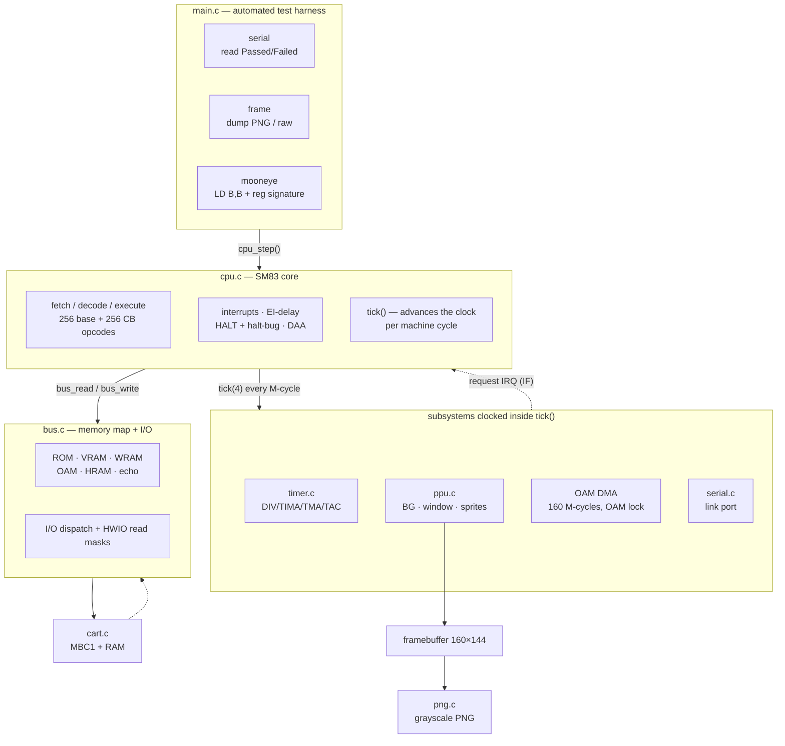

# gameboy-emu

A from-scratch, **cycle-accurate Game Boy (DMG) emulator** written in portable C11,
built incrementally toward SameBoy-class timing precision. No GPU, no heavy
dependencies — the whole core is ~1,500 lines of C and the test harness is fully
automated.


The emphasis is **timing**, not just "the picture looks right." The CPU is stepped at
**machine-cycle granularity** — every memory access and internal cycle advances the
timer, PPU, OAM-DMA and serial subsystems at the exact point it happens — so the
emulator passes not only the easy instruction tests but the long tail of
sub-instruction timing tests.

## What it passes

| Suite | Result |
|-------|--------|
| **Blargg `cpu_instrs`** | 11/11 sub-tests → `Passed` |
| **Blargg `instr_timing`** | `Passed` |
| **Blargg `mem_timing`** | read / write / modify → `Passed` |
| **Blargg `halt_bug`** | `Passed` (HALT-bug correct) |
| **dmg-acid2** | **0 / 23040 pixel mismatches** vs the official reference |
| **Mooneye-GB acceptance (DMG)** | **49 / 66** |

The full regression gate is **66/66 green** (`tools/run_tests.sh`). Every check is
automated — no human in the loop, no "looks correct."

## Architecture



### Components

| File | Lines | Responsibility |
|------|------:|----------------|
| `src/cpu.c` | 451 | SM83 core: every opcode, exact flags, interrupt dispatch, the per-M-cycle clock |
| `src/ppu.c` | 223 | Scanline PPU: background, window, sprites, priorities, palettes → 160×144 framebuffer |
| `src/cart.c` | 146 | Cartridge loading, header parsing, MBC1 banking + external RAM |
| `src/bus.c` | 119 | System memory map, I/O register dispatch, cycle-accurate OAM DMA |
| `src/png.c` | 112 | Dependency-free grayscale PNG writer (for frame dumps / diffs) |
| `src/timer.c` | 103 | DIV/TIMA/TMA/TAC with falling-edge detection and the reload-window quirks |
| `src/main.c` | 103 | Headless entry point + the three test-harness modes |
| `src/serial.c` | 50 | Link-port serial capture (the Blargg `Passed/Failed` channel) |
| `src/gb.h` | 151 | Shared types and the single `GB` machine-state struct |

## The cycle model

Round 1 of this project used the common "instruction-stepped" approximation: execute a
whole instruction, then advance the subsystems by its total cycle count. That passes
`cpu_instrs` and `instr_timing` but **fails every sub-instruction timing test**.

The core was then rewritten so that time advances **inside** each instruction. A single
`tick(g, 4)` advances the timer, PPU, OAM-DMA and serial by one machine cycle, and each
data access ticks the clock right before it reads or writes — *tick-before-access*, so
the access lands on the last T-cycle of its machine cycle, matching the hardware:

```
LD A,(HL)      fetch ──tick(4)── read(HL) ──tick(4)──        = 8 T-cycles
PUSH BC        fetch ──tick(4)── internal ──tick(4)── wr hi ──tick(4)── wr lo ──tick(4)──  = 16
```

Because the budget *emerges* from the ticks rather than a lookup table, the timing is
correct by construction. This is what lets the emulator pass Blargg `mem_timing` and the
Mooneye instruction-timing cluster (`push_timing`, `call_timing`, `ret_timing`, …), and
it is the reason the cycle-accurate **OAM DMA** — which Mooneye uses as a timing probe —
unlocks so many tests at once.

## Build & run

Requires only a C11 compiler (clang or gcc). No external libraries.

```sh
make                                  # builds ./gbemu

# run a serial test ROM (exit 0 = Passed)
./gbemu roms/cpu_instrs.gb

# render N frames and dump a PNG you can open
./gbemu roms/acid2/dmg-acid2.gb --frames 30 --png out.png

# run a Mooneye test (LD B,B breakpoint + register signature)
./gbemu roms/mooneye/acceptance/timer/tim00.gb --mooneye

# the full regression gate
./tools/run_tests.sh                  # -> PASS: 66/66
```

## How tests are verified (no "looks right")

The harness uses four fully-deterministic strategies, one per ROM category:

- **serial** — the ROM writes `Passed`/`Failed` to the link port; the emulator captures
  those bytes (mirroring them to stdout for live progress) and sets its exit code from the
  result (Blargg convention).
- **image-diff** — dmg-acid2 renders a fixed frame; `tools/imgcmp.py` decodes the
  official reference PNG and compares pixel-for-pixel (0 mismatches required).
- **frame-hash** — for screen-only ROMs (e.g. `halt_bug`), a SHA-256 of a deterministic
  frame is compared against a verified-once hash.
- **mooneye** — the ROM ends with `LD B,B` (a software breakpoint) and leaves a
  Fibonacci signature in the registers (`B=3 C=5 D=8 E=13 H=21 L=34` = pass).

## Project layout

```
src/                     cpu, ppu, bus, cart, timer, serial, png, main
tools/                   run_tests.sh (the gate) · imgcmp.py (PNG diff)
roms/                    freely-redistributable test ROMs (Blargg, dmg-acid2, Mooneye)
tests/refs/              reference images for the image-diff gate
STATUS.md, progress.md   current state + full round-by-round build log
```

## Status & roadmap

**Done:** full SM83 core · per-M-cycle timing · scanline PPU (acid2-perfect) · MBC1 ·
cycle-accurate OAM DMA · timer quirks · headless test harness.

**Next (the remaining timing tail):**

- **PPU mode timing** — variable mode-3 length, precise STAT/LYC interrupt edges, LCD-on
  timing. Likely a FIFO pixel-pipeline (per-dot) refactor — this is the next major round.
- **APU** — the four sound channels + audio output.
- **More MBCs** — MBC2/3/5, RTC, battery-backed `.sav`.
- **CGB mode** — double speed, VRAM banks, palettes, HDMA.
- **Tooling** — a debugger, save-states, and rewind.

See `STATUS.md` for the current state and `progress.md` for the full round-by-round log.

## Third-party test ROMs

The `roms/` and `tests/refs/` directories vendor freely-redistributable test ROMs so the
gate is self-contained and reproducible offline:

- **Blargg's test suite** — freely redistributable (Shay Green).
- **Mooneye Test Suite** — MIT, © Joonas Javanainen (Gekkio). See
  `roms/mooneye/ATTRIBUTION.txt`.
- **dmg-acid2** — MIT, © Matt Currie.

Each remains under its own upstream license; they are included for convenience and are
not part of this project's own copyright.

## License

The emulator source (everything under `src/`, `tools/`, `Makefile`) is released under the
**MIT License** — see [LICENSE](LICENSE). Vendored test ROMs are covered by their own
licenses as noted above.
